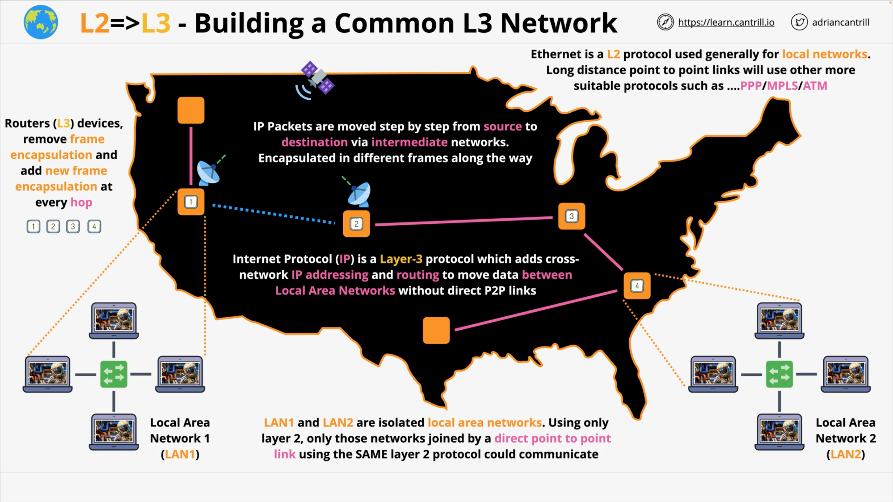
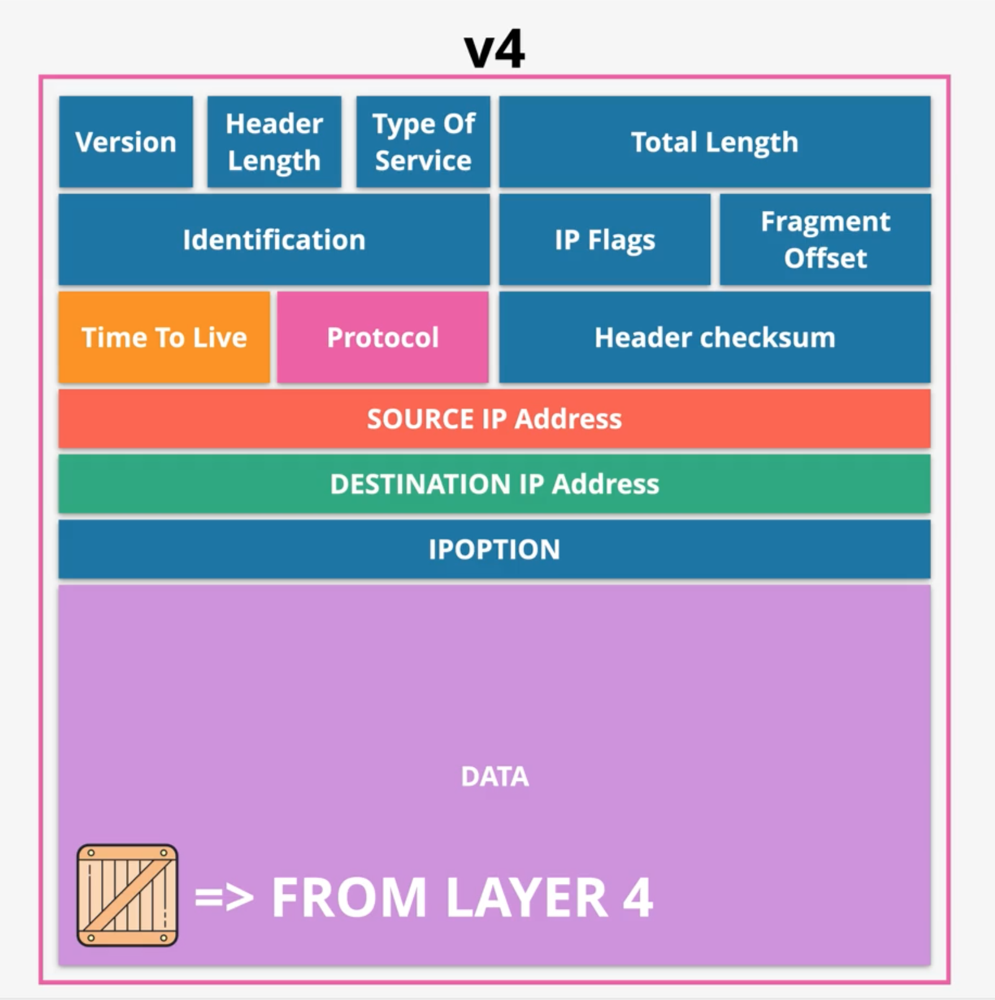

# Layer-3 – Network (part-1)
`Layer-3` requires one or more operational `Layer-2` networks to function. The job of `Layer-3` is to get data from one location to 
another.  

`Layer 3`, also known as the _network layer_, is the third layer in the **OSI model**.  

It is responsible for the _end-to-end_ delivery of 
data between devices on different network segments. This layer defines protocols for _logical addressing_, _routing_, and _fragmentation of data_ **packets** to ensure that they are delivered to the correct destination across different networks. 

Here, I will explore the functions and protocols of `Layer 3` in detail to understand how it enables communication between devices on 
different network segments.  

  

  

As in Local network (L2), devices have unique MAC-addresses to be able to share data, so as L3 level has an IP-addresses to communicate 
inside the global network.  

Now I am going to start with the structure of **packets** which are the data unit used within the `Layer-3` internet protocol.

## Packets
Packets, in many ways are similar to Frames and have the same basic concept.  
They contain some data to be moved, they have source and destination addresses.  
The Difference between these two, is that with Frames, both Source and Destination are generally local.  

With an IP-packet, the Source and Destination addresses could be on the opposite sides of the planet.
During their journey from source to destination, packets remain the same. As they move across the L2 networks, they are placed inside 
Frames, which is known as encapsulation. 

> The Frame is specific to the local network that the `Packet` is moving through and changes 
every time the `Packet` moves between networks.

IP-packets are moved from source to destination across the internet through many intermediate networks.  
Devices of Level-3 are called `routers`, move packet of data across different networks. They encapsulate a packet inside an ethernet 
frame for that part of the journey over that local network.

Now the encapsulation just means that an IP-packet is put inside an ethernet frame for that part of the journey. Then, when it needs to 
be moved into a _new network_, that particular **Frame** is removed, and a new one is added around the same **Packet**, and it's moved 
onto the next local network.

## Packet Structure
Now there are two versions of IP (Internet Protocol) in use:
- IPv4 (has been used for decades)
- IPv6 (new one which adds more scalability into the Packet)

### IPv4 Components:
There are many _fields_, but most important at this point are as:
- SOURCE IP Address – address of the device, which generates the Packet;
- DESTINATION IP Address – intended destination IP for the Packet;
- PROTOCOL – generally contains data provided by another layer-4 and it stores which protocol is used. These are like:
  - ICMP (value = 1)
  - TCP (value = 6)
  - UDP (value = 17)
This field means that the network stack at the destination, specifically the L3 component of that stack, will know which L4 Protocol to 
    pass the data into.
- DATA (generally provided from a L4 Protocol)
- TTL (Time To Live) – the Packet moves through many different intermediate networks between the Source and Destination, and this is the 
  value which defines how many `hops` the `Packet` can move through, and it stops `Packets` looping around forever. If in some reason 
  they can't reach their Destination, then this defines a max number of `hops` the `Packet` can take before being discarded. 

  

  

