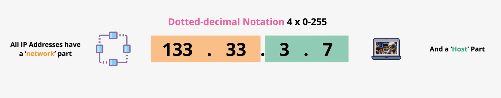
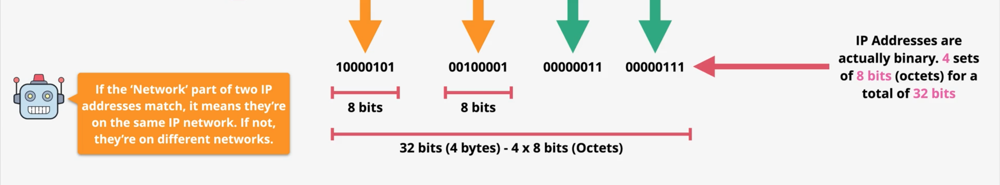
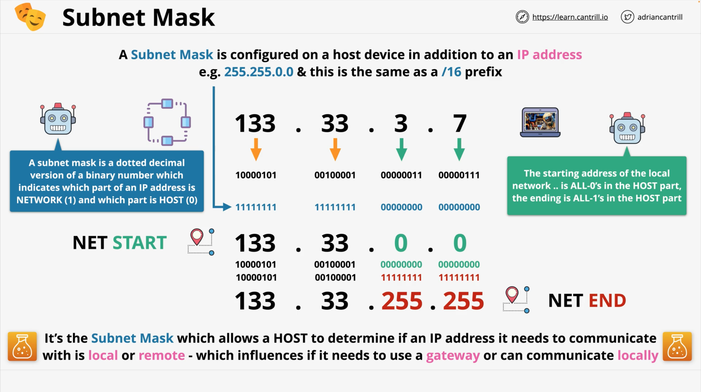

# Layer-3 – Network (part-2)
## IP addressing structure
IP addressing is what defines a device which uses L3 IP Networking.
Now, this is an IP-address:  
`133.33.3.7`  
This format is known as **Dotted Decimal Notation**.  
It has four decimal numbers from 0 to 255 separated by dots.  
All IPs are actually formed of two different parts:
- part which states what IP Network this IP address belongs to;
- part which represents `hosts` on that Network;

<div style="display: flex; justify-content: center; margin: 20px 0">
  
</div> 

IP addresses are actually not dotted decimal, – that is how they are represented for humans. They are actually binary numbers.  
Each decimal part of the IP address is an 8-bit binary number (each is called `Octet`), and that means that the entire IP address is 
32-bits in size.

<div style="display: flex; justify-content: center; margin: 20px 0">
  
</div> 

You can try to convert these using e.g., Javascript:
```javascript
let decimal = 133;
let binary = parseInt(decimal, 2); // 10000101
```
```javascript
let binary = 10000101;
let decimal = binary.toString(2); // 133 
```
If the first 16-bits of the IP address match, then devices are _local_ and on the same Network. If they don't mach, then devices are 
_remote_.

### Static & Dynamic IPs
IP addresses on networks are either statically assigned by humans and this is known as `Static IP`, or they're assigned automatically by 
machines, so they're known as `Dynamic IP`.

Servers on your Network running DHCP server software.
> DHCP – Dynamic Host Configuration Protocol

### Subnet Masks
Subnet Masks are a critical part of IP networking. They are configured on **L3** interfaces along with IP addresses. They help to 
determine if IP addresses are local to each other or remote.

On **L3** interface are also configured `Gateways`. They are IP addresses on the local network which `Packets` are forwarded to.  
`Subnet Mask` allow an IP device to know if an IP address which it's communicating with is on the same network or not.  

So, `Subnet mask` helps to identify which part of the IP address is the network part, and which is of the host part.

<div style="display: flex; justify-content: center; margin: 20px 0">
  
</div> 

## Route Tables & Routes
> BGP – Border Gateway Protocol, this allows routers to communicate with each other to exchange which networks they know about, and this 
> is how the core of the internet functions.

> ISP Router – Internet Service Provider (маршрутизатор)
