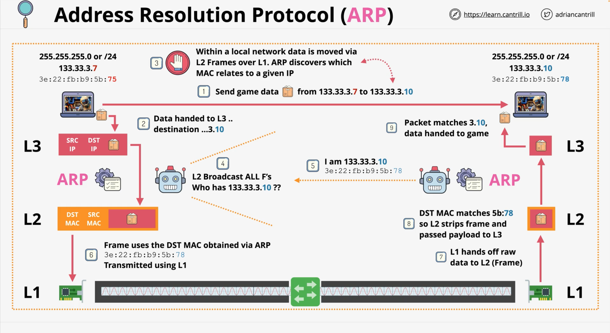
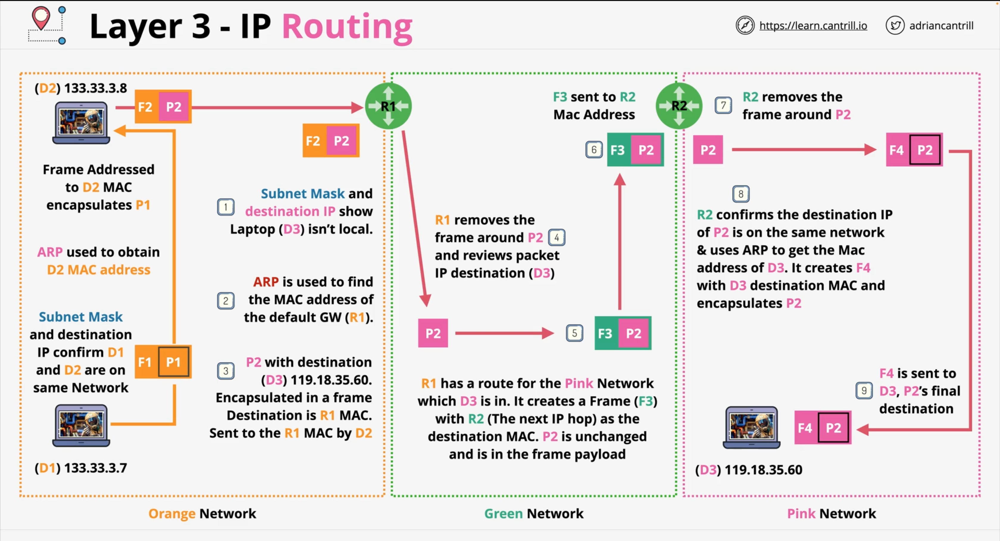

# ARP (Address Resolution Protocol)
The Address Resolution Protocol is used generally when you have an OSI L3 packet, and you want to encapsulate it inside a Frame, and then 
send that Frame to a MAC-address. Initially you do not know the MAC-address, and you need a Protocol which can find this MAC-address for 
a given IP-address.

  

 

---
### Short functional description (Russian)
В сетях Ethernet MAC-адрес получателя обычно определяется с помощью протокола `ARP` (_Address Resolution Protocol_). Когда устройство хочет отправить данные другому устройству и знает его IP-адрес, но не знает его MAC-адрес, оно использует `ARP` для определения MAC-адреса по IP-адресу.

Вот как это работает:

1. Устройство отправляет широковещательный ARP-запрос в сеть, который может быть принят всеми устройствами в этой сети. В запросе
   указывается IP-адрес получателя.
2. Каждое устройство в сети проверяет ARP-запрос. Если IP-адрес в запросе соответствует IP-адресу устройства, оно отвечает на ARP-запрос,
   отправляя свой MAC-адрес обратно на устройство, которое отправило запрос.
3. После получения ARP-ответа устройство теперь знает MAC-адрес получателя и может включить его в заголовок Ethernet-фрейма.

Таким образом, даже если это ваш первый контакт с другим устройством и вы знаете только его IP-адрес, вы все равно можете определить его MAC-адрес с помощью ARP.

---

Now, it is critical to understand, even if two devices are communicating using OSI L3, they're going to be using L2 for local 
communications.  
• If the machines run the same local network, then it will be one L2 Frame per Packet.  
• If the two devices are remote, then you can have many different L2 Frames, which are used along the way. And ARP will be essential to 
ensure that you can obtain MAC-address for a given IP-address.

## Router (Example Scenario)

  

 

## Summary
**Layer-3** has:
- IP-addresses (IPv4/v6) – Cross Networking Addressing
- ARP (Address Resolution Protocol) – finds MAC-address for specified IP
- Route – where to forward this Packet
- Route Tables – info about Multiple Routes
- Router – moves a Packet from SRC to DST – Encapsulating in L2 on the way  
These all allow:
- `Device-to-Device` Communication over the Internet  

What IP does not provide is:
  - No method for channels of communications... SRC IP <=> DST IP only
- Packets could be delivered out of order.  
Individual Packets move across the Internet through intermediate networks, and depending on network conditions, there's no guarantee 
  that those Packets will take the same Route from SRC to DST.  
And because of different network conditions, it is possible they could arrive in a different order. So, if you've got an 
  application which relies on the same ordering at the pont of receipt as at the point of transmission, then we need to add additional 
  things on top of Layer-3. That is something that Layer-4 protocols can help with.
