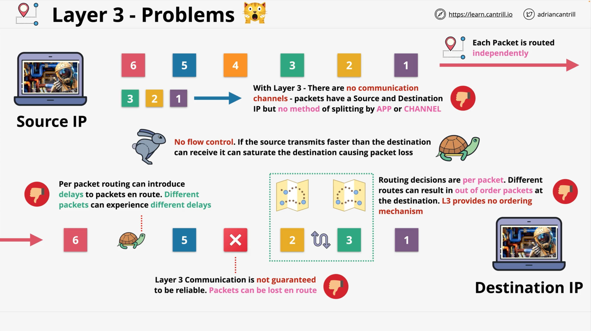
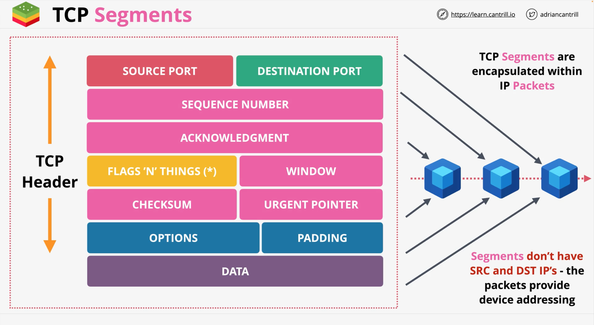

# Layer-4 Transport & Layer-5 Session
Layers 4 and 5, also known as the **Transport** and **Session** layers respectively; they are responsible for managing the `end-to-end` 
communication between applications running on different _devices_.

## L4 Transport
Layer 4, the **transport** layer, is responsible for ensuring that data is delivered reliably and efficiently from one device to another. It does this by establishing connections between applications on different devices, and managing flow control and error recovery. This layer defines two main protocols: 
- the **Transmission Control Protocol** (`TCP`), and 
- the **User Datagram Protocol** (`UDP`). 

Here, you will explore the functions and protocols of `Layer 4` in detail to understand how it enables reliable `end-to-end` communication 
between devices.

> The Transport layer (L4) runs over the top of the Network layer (L3) and provides most of the functionality, which supports most of the 
networking, which we use day-to-day on the internet.

## L5 Session
Layer 5, the **session** layer, is responsible for managing the communication sessions between applications running on different devices. It defines protocols for a session establishment, maintenance, and termination, as well as for managing session security and synchronization. In this lesson, we will explore the functions and protocols of Layer 5 in detail to understand how it enables seamless communication between applications on different devices.

> The Session layer (L5) runs on top of the transport layer (L4), and many features which you might use are often mixed between these two 
layers.

### Layer-3 Problems
Before continue, It is necessary to mention the L3' issues that may or will arise...

Issue 1 
As a mostly common example:

SRC is generating Packets for DST in amount of six: P1, P2, P3, P4, P5, P6. Each packet is routed independently.

In an ideal situation, you expect them to be delivered at a certain time, in an order they are generated and sent. But that is not true. If you are 
communicating via IP, then you are going to have intermittent network conditions. That can result in a few cases where the arrival 
condition of packets is different from the condition when they were generated and sent.

So we are having a situation where P3 arrives before P2.  
L3, specifically IP, provides no method to ensure the ordering of packet arrival. For the Application that uses these packets in a strict 
 order, this would mean a complex logic should need to be built into the application to ensure the packets will be sequenced in the same 
way. This is not a trivial task.

Issue 2   
Packets can just go missing. 
 
This can be due to network outages or network conditions, which cause temporary routing loops.  
Remember 
the TTL component of the Packet. If the number of hops exceeds that TTL, then the Packet will be discarded

Issue 3   
Network conditions can also cause a delay in delivery, 
and for any latency-sensitive applications, this can cause significant issues. 
Every Packet is single, individual, different, isolated, has a different unit of data, which is being routed across the Layer-3 network 
using Layer-2 networks as transit.

Issue 4 
IP has no methods for channels of communication.
 Meaning, right now you are using Web browser, and at the same time your email 
application sends requests, your messenger may be receiving a response, etc. And this has nothing to do with an IP address.

Issue 5   
IP has no flow control.
 If a SRS device is transmitting packets faster than a DST device can receive them, then it can saturate the 
destination connection and cause loss of data, packets, which will be dropped.  

  

 

---

## L4 Protocols
L4 which is built on top of l3, and it adds two new protocols:
- TCP (**Transmission Control Protocol**)
- UDP (**User Datagram Protocol**)

Both add a collection of features depending on which one of them is used. 

### TCP/IP (Slower/Reliable)
TCP/IP – means that TCP is running on top of IP. 

At a high-level, you would pick TCP, when you want reliability, error correction and ordering of data. It is used for most of the 
important application lab protocols, such as:
  - HTTP
  - HTTPS
  - SSH and so on

TCP is a _connection-oriented_ protocol, which means that you need to set up a connection between two devices, and once set up, it creates 
    a bidirectional channel of communication.

---

  

 

---
#### TCP Segments
`Segments` are another containers for data, like `Packets` and `Frames` before them. They are specific for TCP.

`TCP Segments` are placed **inside** `Packets`, and they carry the `Segments` from their SRC to DST.  

Segments do not have SRC or DST IP-addresses because they use the IP packets for the transit from SRC to DST. This is all handled by L3.  
TCP Segments add a capability to IP Packets.

#### TCP Segment's Header
Segments contain their own fields:
- **SRC Port**
- **DST Port**
- **Sequence number** is incremented with each Segment that's sent, and it is unique. It can be used for Error correction if things need to 
  be retransmitted, and it can be used to ensure that when the IP Packet is received, and the TCP Segments are pulled out, they can be 
  correctly ordered.
- **Acknowledgement** is the way that one side can indicate it is received up to and including a certain sequence number. Every Segment, 
  which is transmitted, needs to be acknowledged.
- **Flags 'N' Things*** – this component is 9-bits, and this allows various controls over the TCP Segments and the wider 
  connection. Flags are used to close the connection, or to synchronise sequence numbers, but there are also additional things like: a 
  data offset, and some reserved space.
- **Window** – define the number of bytes that you indicate that you are willing to receive between acknowledgements. Once reached, the 
  sender will pause until you acknowledge that amount of data for a flow control.
- **Checksum** – is used for Error checking (means that TCP layer is able to detect errors and can arrange the retransmission of the data as 
  required.)
- **Urgent Pointer** – setting up this field is meaning that both sides can have separate processing, so that control traffic always takes 
  priority within the communication (such as FTP and Telnet can use this field)
- **Data**

---

### UDP (Faster/Less Reliable)
`UDP` is faster because it doesn't have the `TCP` overhead required for the reliable delivery of data, yet it is not as reliable as 
`TCP` and `Packets` may be delivered out of order, or even be lost.
