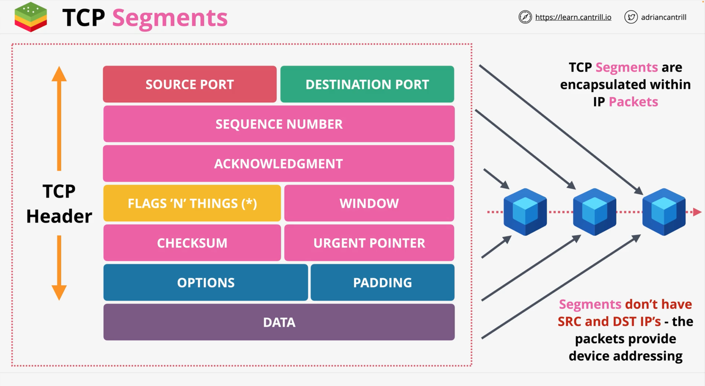

# TCP Segments Architecture
Let's take a quick look at the architecture of `TCP`.

`TCP` like `IP` is used to allow communications between two devices, and it is a **connection based**, it provides a connection 
architecture between two devices. Let's take them as for instance: the **Client** and the **Server**.

A connection is established between two devices using a **random Port** on a Client side, and **known Port** on a Server side. This 
connection is bidirectional and is provided **via the segments encapsulated in IP Packets**. The actual communication between a Client 
and a Server will use Packets of L3, which do not provide, for instance Error checking, ordering, or association.

Nevertheless, `TCP` gives you this guaranteed reliable ordered set of segments.

The two-chanel communication is built by `Segments`, and soon you will how.

## Ports
In such communication, there are two types of ports:
- `well-known port` (Server side) which is, for the first connection is a DST port, and
- `ephemeral port` (Client side) which temporary and during the connection after it is established, will be used as SRC port.

For any responses from Server to Client, this schema of Ports will be reversed, and the SRC will become DST, and DST – SRC.

---

  

 

---

There will be two sorts of Segments: one is with the Client port number, the other one is with the Server port number, and that is why 
you will need two sets of rules on a network `ACL` within **AWS**:
- one set for `initiating part`,
- another set for the `response part`

> When you her the term `ephemeral port` or `high port`, this means the port range that the Client picks as a source port. 

---

  

 

---

## Connection 3-way handshake
With TCP everything is based on connection. You cannot send data without first creating a connection. Both sides must first agree on 
some starting parameters.

### Fags & Things
Flags that can be set to alter a connection: e.g. `ACK` – for acknowledgment, `SYN` – to synchronize sequence numbers, `FIN` – can be 
used to close the connection.

| 1 | 2 | 3 | 4 | 5 | 6 |
|---|---|---|---|---|---|
| U | A | P | R | S | F |
| R | C | S | S | Y | I |
| G | K | H | T | N | N |

1. `SYN` – Client sends `SYN` to a Server a segment, that contains a sequence number `cs` or `ISN` (Initial Sequence Number), saying: "Hey, 
   let's talk?"
2. `SYN+ACK` – Server must reply to this call. So it also picks its own sequence number `ss` (Sends Segment) and `ACK` acknowledge a set to 
   `cs+1`, 
   saying: "Hey, I have received `cs` and send you `cs+1`", meaning: "Sure, let's talk." This type of segment is known as `SYN+ACK`.
3. `ACK` – After the Client receives this Segment from a Server, it replies with `ss+1`. Essentially saying: "Awesome, let's go!"

After these, the connection is established.

## Sessions & State
After the connection is established and both sides know their SRC and DST ports (ephemeral and well-known), the next part is to support 
security to this connection, also known as **Firewall**.

### Firewalls
#### Stateless firewall
With this type of firewall, it doesn't know the state of a connection. So you will need **two** rules for each TCP connection (one on 
both directions):
- `OUT` a rule allowing the OUTBOUND segments
- `IN` a rule allowing the INBOUND or RESPONSE segments

This is what called a Network `ACL` (Access Control List).

#### Stateful firewall
This one understands the state of TCP Segments. So with this it sees the initial traffic and the response traffic as one thing. Meaning, 
if you allow the initiating connection, then you automatically allow the response.

In AWS – this is how the **Security Group** works. The difference is that the Stateful firewall understands L4 and the state of the traffic 
