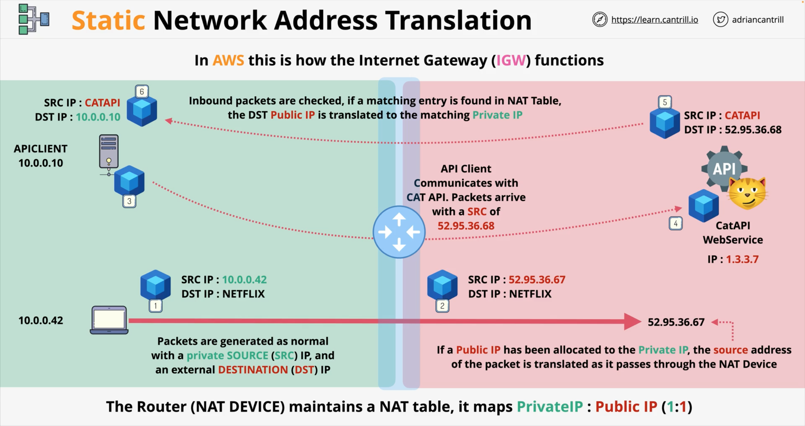

# Network Address Translation (NAT)
NAT is a process, which is designed to address the growing shortage of `IPv4` addresses (they are publicly routable, or they fall 
withing the private address space).

_Publicly routable addresses_ are assigned by a Central agency and Regional agencies, which in turn assign them to an ISPs, and these ISPs 
allocate them to business or consumer and users. They have to be unique to function correctly.

_Private addresses_, such as those in a 10.0.0.0 range, can be used in multiple places, but can't be routed over the internet.

And so, to give internet access to private devices, we need to use **NAT**.  
**NAT** also provides and additional security benefits. There are multiple types of **NAT**. All of them translate _Private IPv4 
addresses_ into _Public IP addresses_, so the packets can flow over the internet, and then translate back in reverse, but each type of 
**NAT** handles this process differently.

### NAT _types_ and _methods_
1. [`Static NAT`](#static-nat) – **1 private** to **1 (fixed) public** address (`IGW` – Internet Gateway)
2. [`Dynamic NAT`](./02-network_address_translation-NAT-p2.md/#dynamic-nat) – is similar, but there is no this static allocation. Instead, you have 
   a pool of public IP addresses to use.
3. [`PAT (Port Address Translation`](./02-network_address_translation-NAT-p2.md/#pat--port-address-translation) – **many private** to **one public** address (`NATGW`)
4. `IPv4` – NAT, as a process only, makes no sense with `IPv6`, since this version adds so many addresses, and you do not need any form 
   of _private addressing_ anymore, and so you won't need translation. 

## Static NAT
With **Static NAT** the router, or NAT device, maintains a **NAT Table** that stores a one-to-one device mapping between _Private IP_ 
and _Public IP_.  
So, any private device which is enabled, will have a dedicated allocated public IPv4 address. This device won't have a public IP address 
configured on it. It's just and allocation.

### Example of Static NAT communication
In AWS this is the process, which is performed by the Internet Gateway (IGW): one-to-one static **Network Address Translation**.   
This process works in a similar way in both directions:

1. Laptop generates a Packet
2. the _SRC IP_ is a laptop private IP address.
3. the _DST IP_, for instance, is one of the Netflix IPs.
4. let's say, for this example, we get this using DNS.
5. the Router in the middle is the **Default Gateway** for any Destinations.
6. local network IP Packets are sent to this Router.
7. let's assume we've allocated a _Public IP_ to this Laptop (52.95.36.67)
8. There is an entry in a **NAT Table**, containing `10.0.0.42` as a _Private IP_ and `52.95.36.67` as a _Public IP_, and these are 
   statically mapped to one another.

| private IP  | public IP     |
|-------------|---------------|
| [10.0.0.42] | [52.95.36.67] |

9. In this case, as the Packet passes through the **NAT Device**, the SRC address of the Packet is translated from _private IP_ to the 
applicable _public IP_, and this results **a New Packet**. So this new Packet still has Netflix as a DST, but now it has a _public IP_ 
   address as SRC.

---

  

 

---

