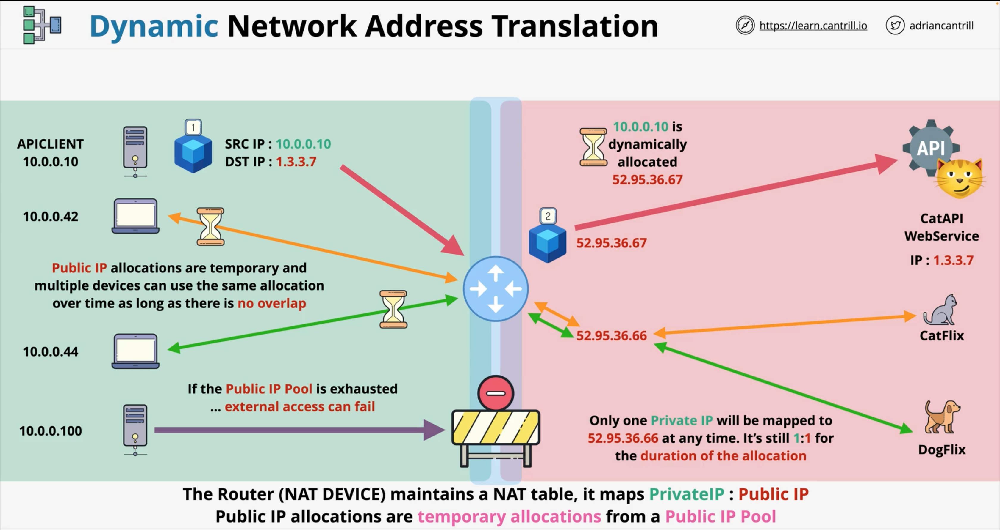
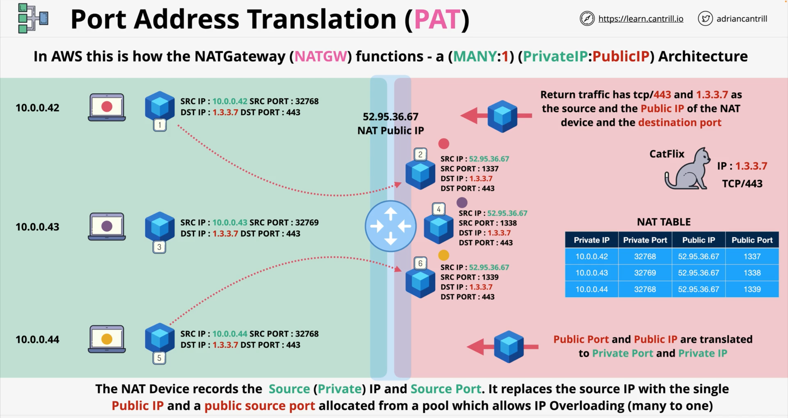

# Dynamic NAT
The principle of Dynamic NAT is similar to Static NAT, except the devices are not allocated a permanent _Public IP_ address. Instead, 
they are allocated a **Temporarily IP** from a _Pool_.  

Let's say, we have two public IP addresses available for use: `52.95.36.66` and `52.95.36.67`. But we have four devices on the left, and 
some of them, sometime need to use public addressing.  
So we cannot use Static NAT, because we do not have enough public IPs.  With Dynamic NAT, the public to private mapping is allocation-based, so is allocated as required. 

1. the Server (`10.0.0.10`) on the top-left is trying to access the CatAPI on the right.
2. it creates a Packet, the SRC IP is itself and the DST IP as CatAPI (`1.3.3.7`).
3. it sends the Packet to the Router (in the middle), which is a Default Gateway for anything which is not local
4. as the Packet passes through a NAT Device, it checks if the Private IP has a current allocation of public addressing from the _pool_. 
   And if it doesn't and one is available, it allocates one dynamically and on a temporary basis.
5. in this case, `52.95.36.67` is allocated temporarily. 
6. CatAPI is able to send a response to this public IP allocation.

---

  

 

---

All other devices can use the same temporary public IP, when it is not busy.  
If the bottom server attempts to access the public internet, when there is no IPs available in the _pool_ to allocate, then this access 
will fail.

This type of NAT is used, when you have less public IPs than private ones, but those private devices sometime need a public access, 
which is bidirectional.

## PAT – Port Address Translation
Port Address Translation is what allows a large number of private devices to share one public IP address. It is how AWS NAT Gateway 
functions within the AWS environment.  
It has a `many-to-one` mapping architecture. So many Private IPs are mapped onto one single Public IPv4 address.

### Example of PAT
We have three private devices on the left, which have their IPs: `10.0.0.42`, `10.0.0.43`, `10.0.0.44` respectively, all wanting to 
access CatFlix with a public IP: `1.3.3.7` and is accessed using Port `TCP/443`, which in this case is **HTTPS**.

Now the PAT works is to use both IP addresses and ports to allow for multiple devices to share the same Public IP.

Every TCP connection, in addition to source and destination IP addresses, has a source and destination Port.  
So, in this example, the CatFlix uses the Destination Port 443.  
The Source Port is randomly assigned by the Client. So as long as the SRC Port is unique, then many private Clients can use the same 
public IP address.  

Let's assume that NAT Public IP is `52.95.36.67`.
1. the "red laptop" generates a Packet, where:
  - SRC IP: `10.0.0.42` and SRC PORT: `32768` (randomly assigned ephemeral port)
  - DST IP: `1.3.3.7` and DST PORT: `443`
2. this Packet arrives to NAT Device, and it is repacked with:
  - SRC IP: `52.95.36.67` and SRC PORT: `1337`
  - DST IP: `1.3.3.7` and DST PORT: `443`
3. then the Packet is transferred to the DST IP.

If the second laptop sends its Packet to the same IP via NAT Device, the same process will be followed.

But if another local device uses the same Port as some other one, then the process still will be followed. NAT Device will assign a unique  
Port to the Packet and transfer it further. 

What the `NAT Device` is doing, is creating a NAT TABLE, which is updated  with the original private IP and private SRC PORT and the new 
SRC IP, which is the public IP address of the NAT Device.

---

  

 

---
