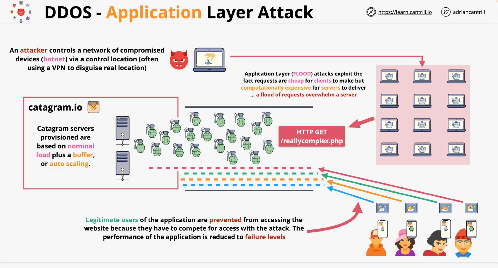
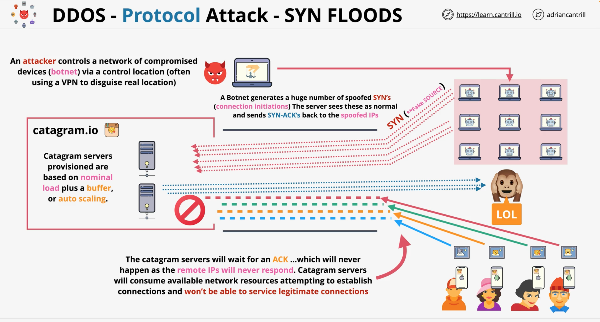
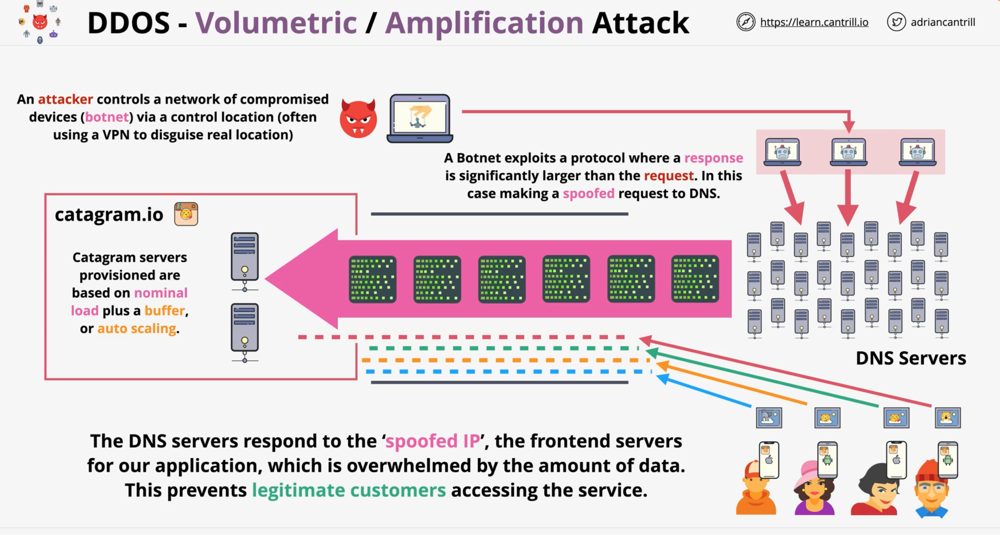

# Distributed Denial of Service (DDOS) Attacks
A Distributed Denial of Service (**DDoS**) attack is a type of cyberattack where multiple compromised devices, often from different locations, are used to flood a targeted website or network with traffic, causing the website or network to become unavailable to its users. 

In a **DDoS attack**, the attackers usually exploit vulnerabilities in the devices or applications to gain control over them and use them to generate a massive amount of traffic. 

**DDoS attacks** can be financially motivated or politically motivated, and they can cause significant damage to the targeted 
organization or individual, such as loss of revenue, loss of a reputation, or even loss of sensitive data. 

Herewith, I will explore how DDoS attacks work & the different types of DDoS attacks.

DDoS attacks:  
- attacks designed to **overload** webservices,
- compete against _legitimate connections_,
- **distributed** – hard to block individual IPs/Ranges

DDos attacks fit into one of three categories:

### **Application Layer** attacks, or _HTTP flood_

---

  

---

### **Protocol-based** attacks, or _SYN flood_
SYN floods spoof a source IP and initiate the connection attempt with a server. The Server 
  tries to perform _step two_ of the "handshake", but it cannot contact the source address, because it's spoofed
---

  

---

### **Volumetric** attacks, or _DNS Amplification_
This relies on how certain protocols such as DNS only take a small amount of data to 
  make a request, such as DNS Resolution request.  
But in response to that they can deliver a large amount of data.)
---

  

---
