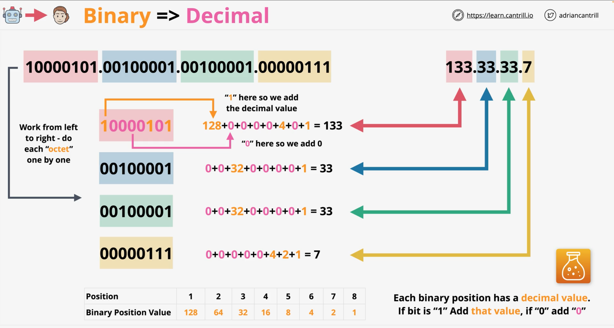

# Decimal to Binary Conversion (IP Addressing)
In computer networking, IP (Internet Protocol) addresses are used to identify and communicate with devices on a network.  
IP addresses are typically represented in **decimal** notation, with **four** decimal numbers separated by periods (e.g. `192.168.1.1`). 

However, computers process and transmit data in binary form, which is a sequence of _0s_ and _1s_.  
To enable communication between devices, IP addresses must be converted from decimal to binary form, and vice versa.  
Herewith, I will explore how to convert IP addresses from decimal to binary form and from binary to decimal form.

A man sees in this IP address decimal numbers: `133.33.33.7` (Dotted Decimal Notation === DDN)  
What does computer see is: `10000101.00100001.00100001.00000111`.  
Specifically – four sets of eight bits.
> `8 Bits` are known as a `byte`  
> Each `Byte` is also known as an `Octet`.

This is actually a 32-Bits binary number:
- 4 x 8 Bits
- 4 x Bytes
- 4 x Octets

## Decimal IP into a Binary IP converting process
`133.33.33.7` – each `decimal number` between dots has a value in a range `0 – 255`

---
### Binary table:

| Position               |  1  |  2   |  3   |  4   |  5  |  6  |  7  |  8  |
|:-----------------------|:---:|:----:|:----:|:----:|:---:|:---:|:---:|:---:|
| Binary position value  | 128 |  64  |  32  |  16  |  8  |  4  |  2  |  1  |
| Binary value           |     |      |      |      |     |     |     |     |

It tells what the Decimal position is in Binary.  

---
### Rules
1. Compare `decimal number` to Binary position value.  
If your number is smaller, than a corresponding **Binary position value**, then 
   you write **0** in that position at the table you are in, move on to the next table position, and start rule #1 again. 
2. If your number is greater or equal to the **Binary position value** then rule #2 applies. Subtract the `binary position` from your 
   decimal number, add **1** in the `Binary value` column.
3. Move on to the next position, goto rule #1 (with the new decimal value) 

---
#### Example with `133.33.33.7`
Move through the **Binary table** from _left_ to _right_

| Position               |  1  | 2  | 3  | 4  | 5 | 6 | 7 | 8 |
|:-----------------------|:---:|:--:|:--:|:--:|:-:|:-:|:-:|:-:|
| Binary position value  | 128 | 64 | 32 | 16 | 8 | 4 | 2 | 1 |
| Binary value           |  1  | 0  | 0  | 0  | 0 | 1 | 0 | 1 |

1. `133` >= 128
2. 133-128 = 5 (new decimal number) So, 5 is a remaining number after subtraction (means **1**)
3. Add **1** to **Binary value**, then go to rule #1

133 === 10000101
33 === 00100001
33 === 00100001
7 === 00000111
So we have a binary converted IP address => `100000101.00100001.00100001.00000111`

## Binary IP into a Decimal IP converting process
The process is a reverse to the previous one.  
1. take the first number of Binary, and compare to **Binary position value**. If it is **1**, then the result is **128**.
2. got to the next Position and compare to the **Binary position value**. If it is **0**, then add 0
3. Continue with the table...

---

  

---

`192.168.1.32` => `11000000.10101000.00000001.00100000`  
192 === 11000000  
168 === 10101000  
1 === 00000001  
32 === 00100000  
