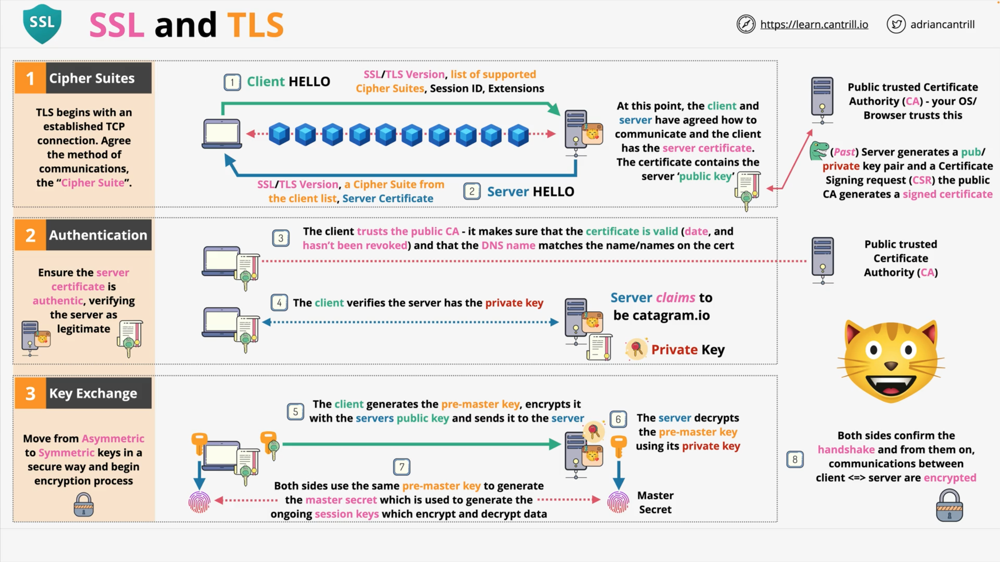

# SSL and TLS
**Secure Socket Layer** (SSL) and **Transport Layer Security** (TLS) are two cryptographic protocols used to provide secure communication over the internet.

SSL was developed by Netscape in the mid-1990s and TLS is its successor. These protocols are used to secure web traffic, email, instant messaging, and other types of internet traffic. 

SSL and TLS use a combination of symmetric and asymmetric encryption to encrypt data, ensuring that information transmitted over the internet is secure and cannot be intercepted by unauthorized parties. In this lesson, we will explore the key features of SSL and TLS

## SSL & TLS provide functions:
- **Privacy** and **Data Integrity** between Client and Server sides.
- **Privacy** (TLS ensures it) – communications are encrypted, so only the Client and the Server have access to that encrypted 
  information. When using TLS, the process starts with an asymmetric encryption architecture. The Server can make its _public key_ 
  available to any Client so that the Client can encrypt data that only that Server can decrypt.  
- **Asymmetric** and **Summetric** encryption:
  - Asymmetric encryption allows for that trustless encryption, where you do not need to arrange for the transfer of keys over a different 
  secure medium.
  - As soon as possible thought, you should aim to move from asymmetric toward symmetric encryption, and use symmetric encryption for any 
  ongoing encryption requirements, because computationally, it's far easier to perform symmetric encryption.
  - SO, part of the negotiation process which TLS perform is moving from _asymmetric_ to _symmetric_ encryption.
- **Identity** (_server_ or _client/server_) verified. Even if it's two-way verification, usually it is a Client which verifies the 
  Server, and this is done using **public key cryptography**.
- **Reliable connection** – protect against alteration of data in transit

## Three main Phases to initiate secure communication
1. First, cipher suites are agreed:
- the first stage focuses on cipher suites. 
> The `cipher suite` is a set of protocols used by TLS (different algorithms and their versions 
  for each of these bellows, and specific versions of types grouped together):
  - key exchange algorithm
  - a bulk encryption algorithm
  - and a message authentication code algorithm or MAC
2. Authentication happens,
3. Keys are exchanged.

These three point are started when the TCP connection is active between the Client and the Server (**L4**). And at the end of three 
 phases, there's an encryption communication channel between the Client and the Server.  
So, to communicate, the Client and the Server have to agree a cipher suite to use. In other words, it may be called as a **Contract**. 

Please follow the diagram of steps, which explain the establishment of secure connection.

---

  

---

## Types of Encryption
### Encrypt KEY
The type of encryption used to **encrypt the key** in TLS is `asymmetric encryption`. In the TLS protocol, a Client will obtain a 
website’s _public key_ from that website’s TLS certificate and use that to initiate secure communication. 

This process is part of the _TLS handshake_, where authentication takes place and the _keys_ are established. However, it’s worth noting that TLS also uses _symmetric-key encryption_ to provide confidentiality to the data that it transmits. 

Once the secure communication has been established with the `asymmetric encryption`, the actual data is encrypted and decrypted using a 
symmetric key. This is because `symmetric encryption` is generally **faster** and more efficient than `asymmetric encryption`. 

> So, the **key** in TLS is encrypted using `asymmetric encryption`.

### Encrypt DATA
The type of encryption used to encrypt data in TLS is `symmetric encryption`.

Once the secure communication has been established with the _asymmetric encryption_ during the _TLS handshake_, the actual data is 
encrypted and decrypted using a `symmetric key`. 

This is because `symmetric encryption` is generally faster and more efficient than _asymmetric encryption_. 

However, it’s worth noting that TLS also uses `_asymmetric encryption_` to provide authentication and to establish the symmetric key. 

> So, the **data** in TLS is encrypted using `symmetric encryption`.
